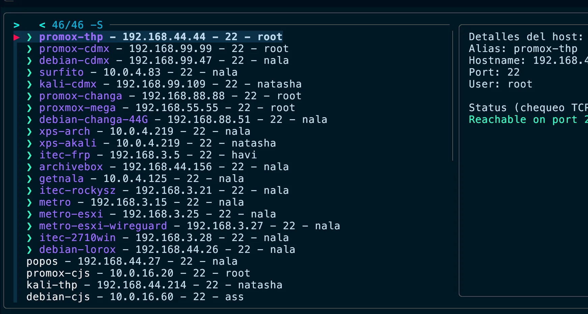
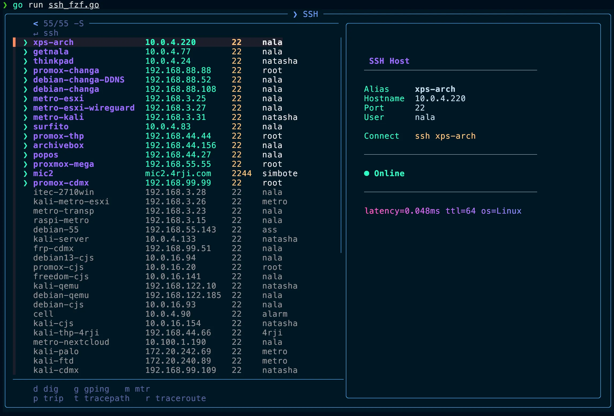

# ssh_fzf

Fast SSH host selector. Reads `~/.ssh/config`, probes each host (online/offline), feeds to `fzf` for interactive selection, then executes `ssh <alias>` with your pick. Includes real-time network diagnostics — dig, gping, mtr, trip (with GeoIP map), tracepath, traceroute — all from the preview panel.

**Original preview:**


**New preview with network tools:**


## What's new — 2026-04-20

Network tools now run directly in the preview panel. Use `Shift+D`, `Shift+G`, `Shift+M`, `Shift+P`, `Shift+T`, and `Shift+R` while a host is selected to toggle `dig`, `gping`, `mtr`, `trip`, `tracepath`, and `traceroute` inside the preview.

When a tool is active, the host card disappears and the preview shows only that tool's output.

| Key | Tool | Command |
|-----|------|---------|
| `Shift+D` | dig | `dig <hostname>` |
| `Shift+G` | gping | `gping <IP>` |
| `Shift+M` | mtr | `mtr -rwzc 20 <IP>` |
| `Shift+P` | trip | `trip --protocol tcp <IP> -G /opt/4rji/GeoLite2-City.mmdb -e` |
| `Shift+T` | tracepath | `tracepath <resolved IP>` |
| `Shift+R` | traceroute | `traceroute -P tcp -p 22 <IP>` |

`trip` displays an interactive geo map of the route. Requires GeoLite2 database at `/opt/4rji/GeoLite2-City.mmdb` — install with `locipinst`.

---

## Requirements

- Go 1.21+
- `fzf` installed on the system
- `ssh` in your `PATH`
- `~/.ssh/config` with defined hosts

## Install from GitHub (no clone needed)

```bash
go install github.com/4rji/binarios-go/ssh_fzf@latest
```

This compiles and places the binary in `$(go env GOPATH)/bin` (or `GOBIN` if set).

## Build locally

```bash
git clone https://github.com/4rji/binarios-go.git
cd binarios-go/ssh_fzf
go build -o ssh_fzf .
```

## Usage

```bash
ssh_fzf
```

- Use `ctrl-s` to toggle sorting inside `fzf`.
- The preview is always visible and generated with a fast TCP check on the configured port.
- The host card always shows a latency line, TTL, and inferred OS via `ping`; if no TTL is found, it falls back to the SSH banner on the configured port.
- `Shift+D`, `Shift+G`, `Shift+M`, `Shift+P`, `Shift+T`, and `Shift+R` toggle the network tools inside the preview; pressing the same key again returns to the host card.


## Environment variables

- `SSH_FZF_TIMEOUT_MS`: timeout in milliseconds for the TCP check (default 400).

## Notes

- If a host has no `Hostname`, the alias is used instead.
- If no `Port` is set, `22` is used.
